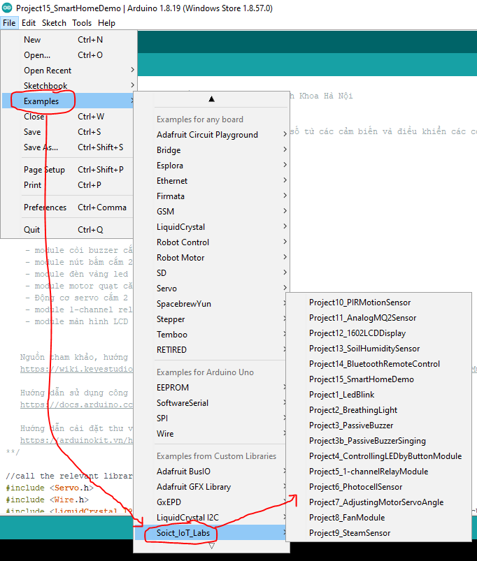
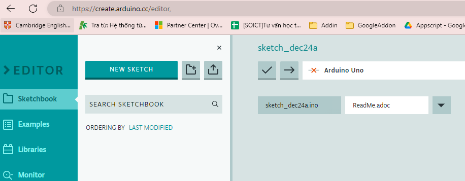
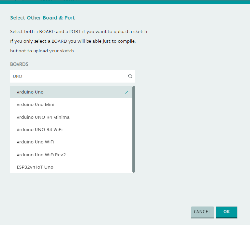
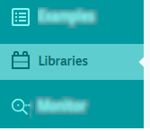
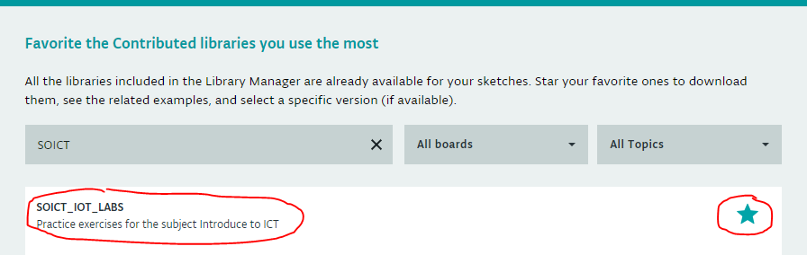
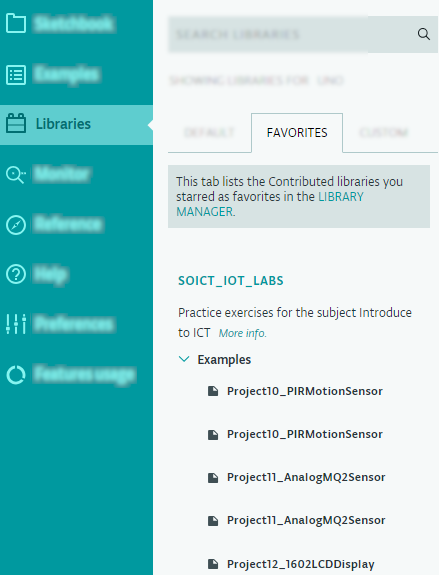

# SOICT IOT LABs

- [Giới thiệu chung](#giới-thiệu-chung)
- [Môi trường hoạt động](#môi-trường-hoạt-động)
- [Cài đặt thư viện](#cài-đặt-thư-viện)
  - [Cài đặt thư viện với Arduino IDE phiên bản Desktop](#cài-đặt-thư-viện-với-arduino-ide-phiên-bản-desktop)
  - [Cài đặt lib với bản Arduino IDE online](#cài-đặt-lib-với-bản-arduino-ide-online)
- [Biên dịch và nạp chương trình lên board Arduino](#biên-dịch-và-nạp-chương-trình-lên-board-arduino)
  - [Biên dịch và nạp chương trình với Arduino IDE phiên bản Desktop](#biên-dịch-và-nạp-chương-trình-với-arduino-ide-phiên-bản-desktop)
  - [Biên dịch và nạp chương trình với Arduino IDE online](#biên-dịch-và-nạp-chương-trình-với-arduino-ide-online)
- [Lời cảm ơn](#lời-cảm-ơn)
- [Liên hệ](#liên-hệ)

## Giới thiệu chung

- Là bộ thư viện mã nguồn dành các bài thực hành của học phần **IT2000 - Nhập môn Công nghệ Thông tin**.
- Mục tiêu: đem lại trải nghiệm và cảm nhận đầu tiên về lĩnh vực IoT cũng như khả năng ứng dụng, mối quan hệ với big data, cloud computing, cũng như các hướng nghiên cứu khác.
- Nhiệm vụ đối với các sinh viên: nạp mã nguồn; trải nghiệm bài lab; phân tích ưu nhược điểm các cảm biến/cơ cấu chấp hành;  thấy được mối tương quan, tính liền mạch, xâu chuỗi giữa các mảng công nghệ IoT, cloud, webapi, bigdata, AI; và đưa ra ý tưởng phát triển mới.

## Môi trường hoạt động

- IDE: 2 lựa chọn
   1. Arduino IDE
      - Cài đặt Arduino IDE từ Microsoft Store, hoặc
      - Tải về và cài đặt Arduino IDE từ trang chủ <https://www.arduino.cc/en/software>, hỗ trợ Windows OS, MacOS, Linux OS, hoặc
      - Chạy phiên bản online ở URL <https://create.arduino.cc/editor>
   2. Visual Studio Code + Platform IO
- Thiết bị: Arduino Uno với bộ khung nhà thông minh *keyestudio smart home kit*   và xe tự hành *Alphabot*
- Kết nối với **Hệ thống dữ liệu trung tâm SOICT IOT HUB <http://siot.soict.ai>

## Cài đặt thư viện

### Cài đặt thư viện với Arduino IDE phiên bản Desktop

*Nếu sử dụng [Arduino IDE online](https://create.arduino.cc/editor) thì xem hướng dẫn [ở đây](#cài-đặt-lib-với-bản-arduino-ide-online)*

- Cài đặt thư viện **SOICT IoT Labs**.

  
- Mở phần **Examples**, và lần lượt từng ví dụ theo từ dễ tới khó theo số thứ tự

  
- Chạy thử nghiệm và quan sát kết quả
- Hiệu chỉnh tham số và quan sát kết quả

### Cài đặt lib với bản Arduino IDE online

1. Mở [Arduino IDE online](https://create.arduino.cc/editor)

   

2. Bấm **NEW SKETCH** để tạo dự án mới. Xem ảnh trên.

3. Click vào dropdown box **Select Other Board and Port**

   
4. Chọn đúng loại board đang sử dụng **Arduino UNO**. Bấm **OK**

   

5. Ở menu trái, chọn **Libraries**

   

6. Ở menu trái mở rộng, bấm **LIBRARY MANAGER**

   

7. Trong giao diện **Favorite the Contributed libraries you use the most**, tìm thư viện **SOICT_IOT_LABS**.
   Bấm biểu tượng **Star** tương ứng ở cùng dòng với thư viện.
   Sau cùng, bấm **Done**.

   

8. Vẫn ở menu trái **Libraries**,  trong menu mở rộng ở tab **FAVOURITES**, đã hiện ra thư viện  **SOICT_IOT_LABS**. Bấm **Examples** và bấm vào từng ví dụ để mở ra các dự án SKETCH mới và có thể chạy được luôn

   

## Biên dịch và nạp chương trình lên board Arduino

### Biên dịch và nạp chương trình với Arduino IDE phiên bản Desktop

Xem [liên kết ngoài](http://arduino.vn/bai-viet/402-huong-dan-nap-chuong-trinh-don-gian-cho-arduino-uno-r3).

### Biên dịch và nạp chương trình với Arduino IDE online

Xem [liên kết ngoài](http://arduino.vn/tutorial/1333-lap-trinh-arduino-tren-may-voi-arduino-create-su-thay-tam-thoi-cho-codebender).

## Lời cảm ơn

- Nhiều bài tập được tham khảo hoặc dẫn xuất trực tiếp từ các ví dụ của nhà sản xuất [Keyestudio] <https://wiki.keyestudio.com/KS0085_Keyestudio_Smart_Home_Kit_for_Arduino>

## Liên hệ

Thư viện được soạn bởi nhóm chuyên môn học phần Nhập môn Công nghệ Thông tin và Truyền thông, Trường Công nghệ Thông tin và Truyền thông, Đại học Bách khoa Hà Nội.

Website: <https://soict.hust.edu.vn>

PS: Vui lòng liên hệ với <tiennd@soict.hust.edu.vn>, <hiennv@soict.hust.edu.vn> để được giải đáp rõ hơn.
